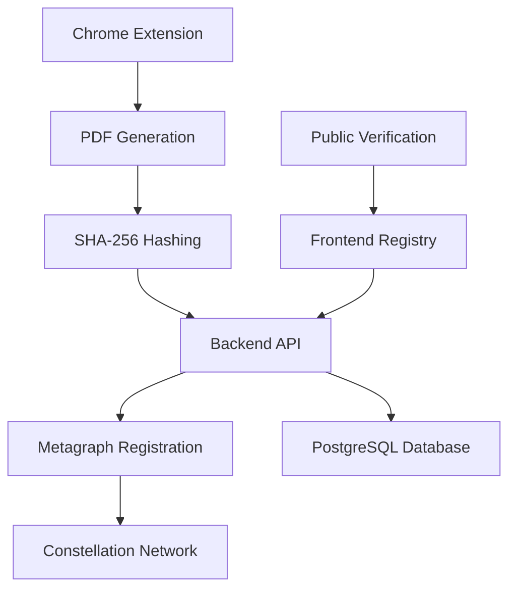

# ProofVault

<div align="center">

[](https://opensource.org/licenses/Apache-2.0)
[](https://nodejs.org/)
[](https://constellationnetwork.io/)
[](#)

**Blockchain-powered digital notary that transforms web content into tamper-proof legal evidence**

[Overview](#-overview) •
[Features](#-features) •
[Quick Start](#-quick-start) •
[Architecture](#-architecture) •
[Documentation](#-documentation) •
[Contributing](#-contributing)

</div>

---

## 🔍 Overview

ProofVault is a comprehensive system that creates **cryptographic digital evidence** for web-captured content using Constellation Network metagraphs. Transform any webpage into legally-defensible digital artifacts with blockchain-backed proof of integrity and immutable timestamps.

### The Problem
In our digital age, proving the authenticity and integrity of web-based evidence is increasingly challenging:
- Screenshots can be easily manipulated
- Web content changes constantly  
- Traditional methods lack cryptographic verification
- Courts need verifiable digital evidence

### The Solution
ProofVault provides a complete chain of custody for digital evidence through:
- **🔐 Cryptographic fingerprinting** with SHA-256 hashing
- **⛓️ Blockchain registration** on Constellation Network
- **📅 Immutable timestamps** for legal compliance
- **🔍 Public verification** interface for authenticity checks

## ✨ Features

### 🎯 Core Capabilities
- **📱 Chrome Extension**: One-click PDF capture from any webpage
- **🔒 Cryptographic Hashing**: SHA-256 fingerprinting prevents tampering
- **⛓️ Blockchain Registration**: Immutable timestamps on Constellation Network
- **✍️ Digital Signatures**: Non-repudiation through cryptographic proof
- **🔍 Verification Interface**: Public registry for document authentication
- **⚖️ Legal-Grade Evidence**: Court-admissible digital notarization

### 🛡️ Security Features
- **Merkle Tree Structure**: Complete chain of custody verification
- **Decentralized Consensus**: No single point of failure
- **Tamper-Evident Storage**: Mathematical proof of integrity
- **Cryptographic Non-repudiation**: Immutable proof of origin

## 🚀 Quick Start

### Prerequisites
- **Node.js** 18+
- **PostgreSQL** 13+
- **Docker** (8GB+ RAM recommended)
- **Chrome Browser**
- **Rust/Cargo** (for hydra script)

### Installation

1. **Clone the repository**
   ```bash
   git clone https://github.com/evidenceonline/ProofVault.git
   cd ProofVault
   ```

2. **Install dependencies**
   ```bash
   npm run install:all
   ```

3. **Set up blockchain environment**
   ```bash
   cd scripts/
   # Install argc for hydra script
   cargo install argc
   
   # Build and start metagraph
   ./hydra build
   ./hydra start-genesis
   ```

4. **Start the application**
   ```bash
   # Return to root directory
   cd ../
   npm run dev
   ```

5. **Load Chrome extension**
   - Navigate to `chrome://extensions/`
   - Enable "Developer mode"
   - Click "Load unpacked" and select `chrome-extension/` directory

## 🏗️ Architecture

### System Flow


### Component Structure
```
ProofVault/
├── chrome-extension/    # Browser extension for PDF capture
├── backend-api/         # Node.js API server with metagraph integration  
├── frontend/           # React verification interface
├── metagraph/          # Custom Constellation Network L0/L1 implementation
├── database/           # PostgreSQL schemas and setup
├── docs/              # Technical documentation
└── scripts/           # Euclid development environment (hydra)
```

### Blockchain Layers
- **Global L0**: Constellation Network main chain
- **Metagraph L0**: ProofVault custom application chain  
- **Currency L1**: Token/currency operations
- **Data L1**: Custom evidence transaction layer

## 🎯 Use Cases

| Industry | Application | Benefit |
|----------|-------------|---------|
| **Legal** | Court evidence preservation | Tamper-proof web evidence with timestamps |
| **Copyright** | IP creation timestamps | Immutable proof of ownership and creation date |
| **Journalism** | Source verification | Authenticated digital sources with integrity proof |
| **Compliance** | Regulatory snapshots | Audit-ready documentation with blockchain backing |
| **Research** | Data capture records | Verifiable research integrity and methodology |

## 🔧 Development

### Available Scripts

```bash
# Development (all components)
npm run dev

# Build all components  
npm run build

# Run tests
npm run test

# Lint code
npm run lint

# Individual component commands
npm run dev:backend     # Backend API only
npm run dev:frontend    # Frontend only  
npm run build:extension # Extension only
```

### Blockchain Operations (Hydra)

```bash
cd scripts/

# Core operations
./hydra build           # Build containers
./hydra start-genesis   # Start from genesis (fresh start)
./hydra start-rollback  # Start from snapshot (preserve history)
./hydra stop           # Stop containers
./hydra status         # Check status
./hydra logs <node>    # View logs

# Remote deployment
./hydra remote-deploy  # Deploy to cloud
./hydra remote-start   # Start remote nodes
./hydra remote-status  # Check remote status
```

## 🌐 Network Information

### Local Development URLs
- **Backend API**: `http://localhost:3001`
- **Frontend**: `http://localhost:3000`
- **Global L0**: `http://localhost:9000`
- **Metagraph L0**: `http://localhost:9200`
- **Currency L1**: `http://localhost:9300`
- **Data L1**: `http://localhost:9400`
- **Grafana Monitoring**: `http://localhost:3000`

### Verification Process
1. **Hash Generation**: SHA-256 of PDF content
2. **Blockchain Query**: Check metagraph for hash record
3. **Timestamp Verification**: Confirm registration time
4. **Signature Validation**: Verify submitter authenticity
5. **Integrity Proof**: Mathematical verification of document integrity

## 📚 Documentation

- **[📋 System Design](docs/DESIGN.md)** - Technical architecture overview
- **[🔌 API Reference](docs/API.md)** - Backend endpoints documentation  
- **[🧩 Extension Guide](docs/EXTENSION.md)** - Chrome extension usage
- **[🚀 Deployment Guide](docs/DEPLOYMENT.md)** - Production setup instructions
- **[🤝 Contributing Guide](docs/CONTRIBUTING.md)** - Development guidelines
- **[📄 PDF Evidence System Design](PDF_EVIDENCE_SYSTEM_DESIGN.md)** - Complete technical specification

## 🔒 Security Model

### Cryptographic Protection
- **SHA-256 Hashing**: Prevents content tampering (any change = different hash)
- **Digital Signatures**: Cryptographic proof of document submitter
- **Blockchain Immutability**: Hash cannot be altered once consensus reached
- **Merkle Tree Structure**: Provides complete verification chain

### Legal Standing
- **Blockchain Timestamps**: Increasingly recognized in courts worldwide
- **Cryptographic Hashes**: Provide forensic-level integrity proof  
- **Digital Signatures**: Non-repudiation through mathematical proof
- **Decentralized Verification**: No reliance on single trusted party

## 🛠️ Implementation Phases

### Phase 1: Metagraph Enhancement ✅
- Custom PDF record data structures
- Transaction types for PDF registration
- Validation logic and state management

### Phase 2: Chrome Extension 🚧
- Manifest V3 framework
- Screen capture and PDF generation
- SHA-256 hashing and digital signing

### Phase 3: Backend API 📋
- Node.js/Express server
- Metagraph integration
- PostgreSQL database setup

### Phase 4: Frontend Registry 📋
- React-based verification interface
- PDF browser and search functionality
- Public verification tools

### Phase 5: Integration & Testing 📋
- End-to-end testing
- Security audit
- Production deployment

## 🤝 Contributing

We welcome contributions! Please see our [Contributing Guide](docs/CONTRIBUTING.md) for details.

### Development Workflow
1. Fork the repository
2. Create a feature branch (`git checkout -b feature/amazing-feature`)
3. Make your changes following our coding standards
4. Add tests if applicable
5. Run linting: `npm run lint`
6. Commit with conventional commits (`git commit -m 'feat: add amazing feature'`)
7. Push to your fork (`git push origin feature/amazing-feature`)
8. Open a Pull Request

## 📄 License

This project is licensed under the Apache License 2.0 - see the [LICENSE](LICENSE) file for details.

## 🙏 Acknowledgments

- Built on [Constellation Network](https://constellationnetwork.io/) infrastructure
- Powered by [Tessellation Framework](https://github.com/Constellation-Labs/tessellation)
- Uses [Euclid Development Environment](https://github.com/Constellation-Labs/euclid-development-environment)
- Inspired by the critical need for trustworthy digital evidence in our digital world

## 📞 Support

For questions, issues, or support:
- 🐛 [Report a Bug](https://github.com/evidenceonline/ProofVault/issues/new?template=bug_report.md)
- 💡 [Request a Feature](https://github.com/evidenceonline/ProofVault/issues/new?template=feature_request.md)  
- 💬 [Start a Discussion](https://github.com/evidenceonline/ProofVault/discussions)

---

<div align="center">

**[⭐ Star this repo](https://github.com/evidenceonline/ProofVault)** if you find ProofVault useful!

Made with ❤️ by the ProofVault Team

*Transforming digital evidence through blockchain technology*

</div>