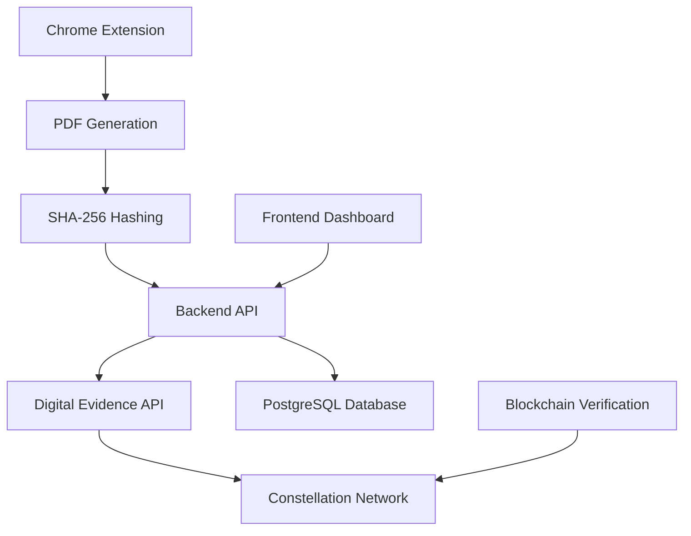

# ProofVault

<div align="center">

[](https://opensource.org/licenses/Apache-2.0)
[](https://nodejs.org/)
[](https://constellationnetwork.io/)
[](#)

**Blockchain-powered digital notary that transforms web content into tamper-proof legal evidence**

[Overview](#-overview) •
[Features](#-features) •
[Quick Start](#-quick-start) •
[Architecture](#-architecture) •
[Documentation](#-documentation) •
[Contributing](#-contributing)

</div>

---

## 🔍 Overview

ProofVault is a comprehensive system that creates **cryptographic digital evidence** for web-captured content using Constellation Network's Digital Evidence API. Transform any webpage into legally-defensible digital artifacts with blockchain-backed proof of integrity and immutable timestamps.

### The Problem
In our digital age, proving the authenticity and integrity of web-based evidence is increasingly challenging:
- Screenshots can be easily manipulated
- Web content changes constantly  
- Traditional methods lack cryptographic verification
- Courts need verifiable digital evidence

### The Solution
ProofVault provides a complete chain of custody for digital evidence through:
- **Cryptographic fingerprinting** with SHA-256 hashing
- **Blockchain registration** on Constellation Network
- **Immutable timestamps** for legal compliance
- **Public verification** interface for authenticity checks

## ✨ Features

### Core Capabilities
- **Chrome Extension**: One-click PDF capture from any webpage
- **Cryptographic Hashing**: SHA-256 fingerprinting prevents tampering
- **Blockchain Registration**: Immutable timestamps on Constellation Network
- **Digital Signatures**: Non-repudiation through cryptographic proof
- **Verification Interface**: Public registry for document authentication
- **Legal-Grade Evidence**: Court-admissible digital notarization

### 🛡️ Security Features
- **Merkle Tree Structure**: Complete chain of custody verification
- **Decentralized Consensus**: No single point of failure
- **Tamper-Evident Storage**: Mathematical proof of integrity
- **Cryptographic Non-repudiation**: Immutable proof of origin

## 🚀 Quick Start

### Prerequisites
- **Node.js** 18+
- **PostgreSQL** 13+
- **Chrome Browser**
- **Constellation Digital Evidence API Account** (for blockchain integration)

### Installation

1. **Clone the repository**
   ```bash
   git clone https://github.com/evidenceonline/ProofVault.git
   cd ProofVault
   git checkout digital-evidence
   ```

2. **Install dependencies**
   ```bash
   # Install API dependencies
   cd api && npm install

   # Install frontend dependencies
   cd ../frontend && npm install
   ```

3. **Configure Digital Evidence API**
   ```bash
   # Copy environment template
   cp api/.env.example api/.env

   # Edit .env file with your Digital Evidence API credentials:
   # DE_API_KEY=your_api_key
   # DE_ORGANIZATION_ID=your_org_id
   # DE_TENANT_ID=your_tenant_id
   ```

4. **Set up PostgreSQL database**
   ```bash
   # Create database and run setup script
   psql -U postgres -c "CREATE DATABASE proofvault;"
   psql -U postgres -d proofvault -f setup_proofvaultdb_test.sql
   ```

5. **Start the application**
   ```bash
   # Start API server (from api directory)
   cd api && npm start

   # Start frontend (from frontend directory, new terminal)
   cd frontend && npm start
   ```

6. **Load Chrome extension**
   - Navigate to `chrome://extensions/`
   - Enable "Developer mode"
   - Click "Load unpacked" and select `chrome-extension/` directory

## 🏗️ Architecture

### System Flow


### Component Structure
```
ProofVault/
├── chrome-extension/    # Browser extension for PDF capture
├── api/                # Node.js API server with Digital Evidence integration
├── frontend/           # Next.js dashboard interface
├── proofvault-client/  # Blockchain client utilities
├── DOCUMENTATION.md    # Complete technical documentation
└── setup_proofvaultdb_test.sql  # Database setup
```

### Integration Layers
- **Chrome Extension**: Captures web content and generates PDFs
- **API Backend**: Processes evidence and integrates with Digital Evidence API
- **Digital Evidence API**: Constellation Network's managed blockchain service
- **Constellation Network**: Immutable blockchain storage and verification

## 🎯 Use Cases

| Industry | Application | Benefit |
|----------|-------------|---------|
| **Legal** | Court evidence preservation | Tamper-proof web evidence with timestamps |
| **Copyright** | IP creation timestamps | Immutable proof of ownership and creation date |
| **Journalism** | Source verification | Authenticated digital sources with integrity proof |
| **Compliance** | Regulatory snapshots | Audit-ready documentation with blockchain backing |
| **Research** | Data capture records | Verifiable research integrity and methodology |

## 🔧 Development

### Available Scripts

```bash
# Start API server
cd api && npm start

# Start frontend dashboard
cd frontend && npm start

# Run development mode with auto-reload
cd api && npm run dev
cd frontend && npm run dev

# Install dependencies
cd api && npm install
cd frontend && npm install
```

## 🌐 Network Information

### Local Development URLs
- **API Backend**: `http://localhost:4000`
- **Frontend Dashboard**: `http://localhost:4002`
- **Digital Evidence Explorer**: `https://digitalevidence.constellationnetwork.io/`

### Verification Process
1. **Hash Generation**: SHA-256 of PDF content
2. **Digital Evidence Submission**: Submit fingerprint via Digital Evidence API
3. **Blockchain Recording**: Immutable storage on Constellation Network
4. **Status Tracking**: Real-time verification status updates
5. **Public Verification**: Access verification certificates via blockchain explorer

## 📚 Documentation

- **[Complete Documentation](DOCUMENTATION.md)** - Comprehensive system documentation including:
  - Technical architecture and implementation
  - Production deployment guide
  - Legal framework and court admissibility
  - API reference and usage instructions
  - Blockchain integration details
  - Troubleshooting guide

## 🔒 Security Model

### Cryptographic Protection
- **SHA-256 Hashing**: Prevents content tampering (any change = different hash)
- **Digital Signatures**: Cryptographic proof of document submitter
- **Blockchain Immutability**: Hash cannot be altered once consensus reached
- **Merkle Tree Structure**: Provides complete verification chain

### Legal Standing
- **Blockchain Timestamps**: Increasingly recognized in courts worldwide
- **Cryptographic Hashes**: Provide forensic-level integrity proof  
- **Digital Signatures**: Non-repudiation through mathematical proof
- **Decentralized Verification**: No reliance on single trusted party

## 🤝 Contributing

We welcome contributions! Please see our [Contributing Guide](docs/CONTRIBUTING.md) for details.

### Development Workflow
1. Fork the repository
2. Create a feature branch (`git checkout -b feature/amazing-feature`)
3. Make your changes following our coding standards
4. Add tests if applicable
5. Run linting: `npm run lint`
6. Commit with conventional commits (`git commit -m 'feat: add amazing feature'`)
7. Push to your fork (`git push origin feature/amazing-feature`)
8. Open a Pull Request

## 📄 License

This project is licensed under the Apache License 2.0 - see the [LICENSE](LICENSE) file for details.

## 🙏 Acknowledgments

- Built on [Constellation Network](https://constellationnetwork.io/) infrastructure
- Powered by [Digital Evidence API](https://digitalevidence.constellationnetwork.io/)
- Inspired by the critical need for trustworthy digital evidence in our digital world

**[⭐ Star this repo](https://github.com/evidenceonline/ProofVault)** if you find ProofVault useful!

Made with ❤️ by the ProofVault Team

*Transforming digital evidence through blockchain technology*

</div>
