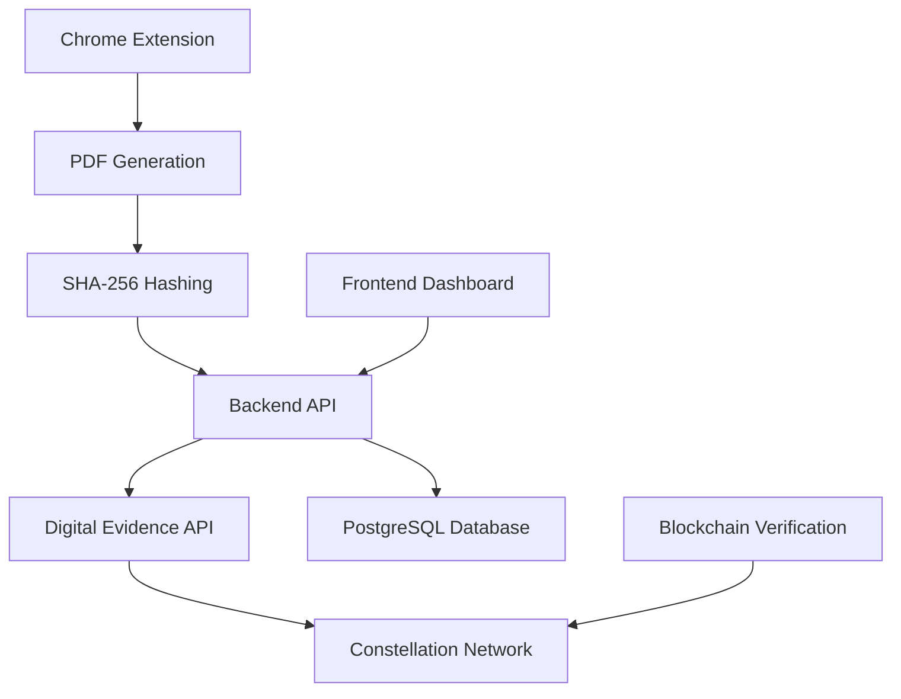

# ProofVault

<div align="center">

[](https://opensource.org/licenses/Apache-2.0)
[](https://nodejs.org/)
[](https://constellationnetwork.io/)
[](#)

**Blockchain-powered digital notary that transforms web content into tamper-proof legal evidence**

[Overview](#-overview) •
[Features](#-features) •
[Quick Start](#-quick-start) •
[Architecture](#-architecture) •
[Documentation](#-documentation) •
[Contributing](#-contributing)

</div>

---

## 🔍 Overview

ProofVault is a comprehensive system that creates **cryptographic digital evidence** for web-captured content using Constellation Network's Digital Evidence API. Transform any webpage into legally-defensible digital artifacts with blockchain-backed proof of integrity and immutable timestamps.

### The Problem
In our digital age, proving the authenticity and integrity of web-based evidence is increasingly challenging:
- Screenshots can be easily manipulated
- Web content changes constantly  
- Traditional methods lack cryptographic verification
- Courts need verifiable digital evidence

### The Solution
ProofVault provides a complete chain of custody for digital evidence through:
- **Cryptographic fingerprinting** with SHA-256 hashing
- **Blockchain registration** on Constellation Network
- **Immutable timestamps** for legal compliance
- **Public verification** interface for authenticity checks

## ✨ Features

### Core Capabilities
- **Chrome Extension**: One-click PDF capture from any webpage
- **Cryptographic Hashing**: SHA-256 fingerprinting prevents tampering
- **Blockchain Registration**: Immutable timestamps on Constellation Network
- **Digital Signatures**: Non-repudiation through cryptographic proof
- **Verification Interface**: Public registry for document authentication
- **Legal-Grade Evidence**: Court-admissible digital notarization

### 🛡️ Security Features
- **Merkle Tree Structure**: Complete chain of custody verification
- **Decentralized Consensus**: No single point of failure
- **Tamper-Evident Storage**: Mathematical proof of integrity
- **Cryptographic Non-repudiation**: Immutable proof of origin

## 🚀 Quick Start

> **New!** Docker setup with ZERO configuration! Or use our automated setup script for native installation.

### Option 1: Docker Setup (Fastest - ZERO Config! 🐳)

**No Node.js, no PostgreSQL install needed!** Just Docker.

```bash
# 1. Clone the repository
git clone https://github.com/evidenceonline/ProofVault.git
cd ProofVault
git checkout feature/automated-setup-and-improvements

# 2. Configure credentials
cp .env.docker.example .env.docker
# Edit .env.docker with your database password and JWT secret
# Digital Evidence API credentials are OPTIONAL (see .env.docker.example for details)

# 3. Start everything with one command
docker compose -f docker-compose.dev.yml up -d
```

**That's it!** Your application is running at:
- **Frontend Dashboard**: http://localhost:4002
- **API Server**: http://localhost:4000

**What this does automatically:**
- ✅ Creates PostgreSQL database
- ✅ Initializes database schema
- ✅ Installs all dependencies
- ✅ Starts API server
- ✅ Starts frontend dashboard

**Prerequisites:** [Docker Desktop](https://www.docker.com/products/docker-desktop/) installed

**Useful Docker Commands:**
```bash
# View logs from all services
docker compose -f docker-compose.dev.yml logs -f

# Stop all services
docker compose -f docker-compose.dev.yml down

# Stop and remove all data (fresh start)
docker compose -f docker-compose.dev.yml down -v

# Restart services
docker compose -f docker-compose.dev.yml restart

# Check service status
docker compose -f docker-compose.dev.yml ps
```

---

### Option 2: Automated Setup (Recommended for Native Install ⚡)

**Prerequisites:**
- **Node.js** 18+ ([Download](https://nodejs.org/))
- **PostgreSQL** 13+ ([Download](https://www.postgresql.org/download/))
- **Chrome Browser** (for extension)
- **Constellation Digital Evidence API Account** (optional - get it at [digitalevidence.constellationnetwork.io](https://digitalevidence.constellationnetwork.io/))

The fastest way to get ProofVault running:

1. **Clone the repository**
   ```bash
   git clone https://github.com/evidenceonline/ProofVault.git
   cd ProofVault
   git checkout feature/automated-setup-and-improvements
   ```

2. **Run the automated setup**
   ```bash
   chmod +x setup.sh
   ./setup.sh
   ```

   The setup script will:
   - ✅ Verify all prerequisites
   - ✅ Install all dependencies (API + Frontend)
   - ✅ Create PostgreSQL database and user
   - ✅ Generate configuration files
   - ✅ Set up environment variables
   - ✅ Validate the installation

3. **Start the application**
   ```bash
   npm run dev
   ```

That's it! Your application is running at:
- **Frontend Dashboard**: http://localhost:4002
- **API Server**: http://localhost:4000

📘 For more detailed instructions, see [QUICKSTART.md](QUICKSTART.md)

---

### Option 3: Manual Setup

If you prefer manual setup or need more control:

1. **Clone the repository**
   ```bash
   git clone https://github.com/evidenceonline/ProofVault.git
   cd ProofVault
   git checkout feature/automated-setup-and-improvements
   ```

2. **Install all dependencies**
   ```bash
   npm run install:all
   ```

3. **Set up PostgreSQL database**
   ```bash
   # Create database user
   sudo -u postgres psql -c "CREATE USER proofvaultuser WITH PASSWORD 'your_password';"

   # Create database
   sudo -u postgres psql -c "CREATE DATABASE proofvaultdb_test WITH OWNER proofvaultuser;"

   # Grant permissions
   sudo -u postgres psql -c "GRANT ALL PRIVILEGES ON DATABASE proofvaultdb_test TO proofvaultuser;"

   # Run setup script (copy to /tmp to avoid permission issues)
   cp setup_proofvaultdb_test.sql /tmp/
   sudo -u postgres psql -d proofvaultdb_test -f /tmp/setup_proofvaultdb_test.sql
   ```

4. **Configure API environment**
   ```bash
   # Copy environment template
   cp api/.env.example api/.env

   # Edit api/.env and update:
   # - DB_PASSWORD=your_password
   # - DE_API_KEY=your_api_key (optional)
   # - DE_ORGANIZATION_ID=your_org_id (optional)
   # - DE_TENANT_ID=your_tenant_id (optional)
   ```

5. **Start the application**
   ```bash
   # Option A: Start both services at once
   npm run dev

   # Option B: Start services separately (two terminals)
   # Terminal 1:
   cd api && npm start

   # Terminal 2:
   cd frontend && npm run dev
   ```

6. **Load Chrome extension**
   - Navigate to `chrome://extensions/`
   - Enable "Developer mode"
   - Click "Load unpacked" and select `chrome-extension/` directory

## 🏗️ Architecture

### System Flow


### Component Structure
```
ProofVault/
├── api/                     # Node.js API server with Digital Evidence integration
├── chrome-extension/        # Browser extension for PDF capture
├── frontend/                # Next.js dashboard interface
├── business-site/           # Marketing website
├── web/                     # Additional web components
├── docker-compose.dev.yml   # Docker development configuration
├── docker-compose.yml       # Docker production configuration
├── DOCUMENTATION.md         # Complete technical documentation
├── setup_proofvaultdb_test.sql  # Database setup script
├── setup.sh                 # Automated setup script
└── package.json             # Root dependencies
```

### Integration Layers
- **Chrome Extension**: Captures web content and generates PDFs
- **API Backend**: Processes evidence and integrates with Digital Evidence API
- **Digital Evidence API**: Constellation Network's managed blockchain service
- **Constellation Network**: Immutable blockchain storage and verification

## 🎯 Use Cases

| Industry | Application | Benefit |
|----------|-------------|---------|
| **Legal** | Court evidence preservation | Tamper-proof web evidence with timestamps |
| **Copyright** | IP creation timestamps | Immutable proof of ownership and creation date |
| **Journalism** | Source verification | Authenticated digital sources with integrity proof |
| **Compliance** | Regulatory snapshots | Audit-ready documentation with blockchain backing |
| **Research** | Data capture records | Verifiable research integrity and methodology |

## 🔧 Development

### Available Scripts

```bash
# Start API server (production mode)
cd api && npm start

# Start frontend dashboard (development mode with hot reload)
cd frontend && npm run dev

# Run API in development mode with auto-reload
cd api && npm run dev

# Install dependencies
cd api && npm install
cd frontend && npm install

# Run both services together (from root directory)
npm run dev
```

## 🌐 Network Information

### Local Development URLs
- **API Backend**: `http://localhost:4000`
- **Frontend Dashboard**: `http://localhost:4002`
- **Digital Evidence Explorer**: `https://digitalevidence.constellationnetwork.io/`

### Verification Process
1. **Hash Generation**: SHA-256 of PDF content
2. **Digital Evidence Submission**: Submit fingerprint via Digital Evidence API
3. **Blockchain Recording**: Immutable storage on Constellation Network
4. **Status Tracking**: Real-time verification status updates
5. **Public Verification**: Access verification certificates via blockchain explorer

## 🔧 Troubleshooting

### Common Issues and Solutions

#### Port Already in Use
If you see "port 4000 already in use" or "port 4002 already in use":
```bash
# Find what's using the port
lsof -i :4000
lsof -i :4002

# Kill the process or change ports in docker-compose.dev.yml
```

#### Database Connection Errors
If the API can't connect to the database:
```bash
# Check database container is running
docker compose -f docker-compose.dev.yml ps

# View database logs
docker compose -f docker-compose.dev.yml logs postgres

# Restart database
docker compose -f docker-compose.dev.yml restart postgres
```

#### Docker Not Starting
```bash
# Make sure Docker Desktop is running
docker --version

# Clean up and restart
docker compose -f docker-compose.dev.yml down -v
docker compose -f docker-compose.dev.yml up -d
```

#### Environment Variables Not Loading
```bash
# Verify .env.docker exists and has correct values
cat .env.docker

# Make sure you're using --env-file flag
docker compose -f docker-compose.dev.yml --env-file .env.docker up -d
```

#### Permission Denied (setup.sh)
```bash
# Make the setup script executable
chmod +x setup.sh
./setup.sh
```

### Getting Help
- **GitHub Issues**: [Report bugs or request features](https://github.com/evidenceonline/ProofVault/issues)
- **Documentation**: Check [DOCUMENTATION.md](DOCUMENTATION.md) for detailed guides
- **Digital Evidence API**: Visit [digitalevidence.constellationnetwork.io](https://digitalevidence.constellationnetwork.io/)

---

## 📚 Documentation

- **[Complete Documentation](DOCUMENTATION.md)** - Comprehensive system documentation including:
  - Technical architecture and implementation
  - Production deployment guide
  - Legal framework and court admissibility
  - API reference and usage instructions
  - Blockchain integration details
  - Advanced troubleshooting

## 🔒 Security Model

### Cryptographic Protection
- **SHA-256 Hashing**: Prevents content tampering (any change = different hash)
- **Digital Signatures**: Cryptographic proof of document submitter
- **Blockchain Immutability**: Hash cannot be altered once consensus reached
- **Merkle Tree Structure**: Provides complete verification chain

### Legal Standing
- **Blockchain Timestamps**: Increasingly recognized in courts worldwide
- **Cryptographic Hashes**: Provide forensic-level integrity proof  
- **Digital Signatures**: Non-repudiation through mathematical proof
- **Decentralized Verification**: No reliance on single trusted party

## 🤝 Contributing

We welcome contributions!

### Development Workflow
1. Fork the repository
2. Create a feature branch (`git checkout -b feature/amazing-feature`)
3. Make your changes following our coding standards
4. Add tests if applicable
5. Run linting: `npm run lint` (if available)
6. Commit with conventional commits (`git commit -m 'feat: add amazing feature'`)
7. Push to your fork (`git push origin feature/amazing-feature`)
8. Open a Pull Request

## 📄 License

This project is licensed under the Apache License 2.0 - see the [LICENSE](LICENSE) file for details.

## 🙏 Acknowledgments

- Built on [Constellation Network](https://constellationnetwork.io/) infrastructure
- Powered by [Digital Evidence API](https://digitalevidence.constellationnetwork.io/)
- Inspired by the critical need for trustworthy digital evidence in our digital world

**[⭐ Star this repo](https://github.com/evidenceonline/ProofVault)** if you find ProofVault useful!

Made with ❤️ by the ProofVault Team

*Transforming digital evidence through blockchain technology*

</div>
