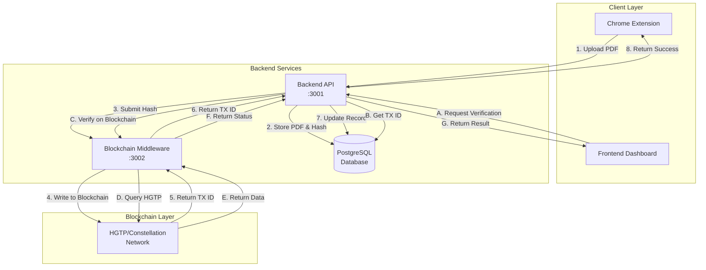
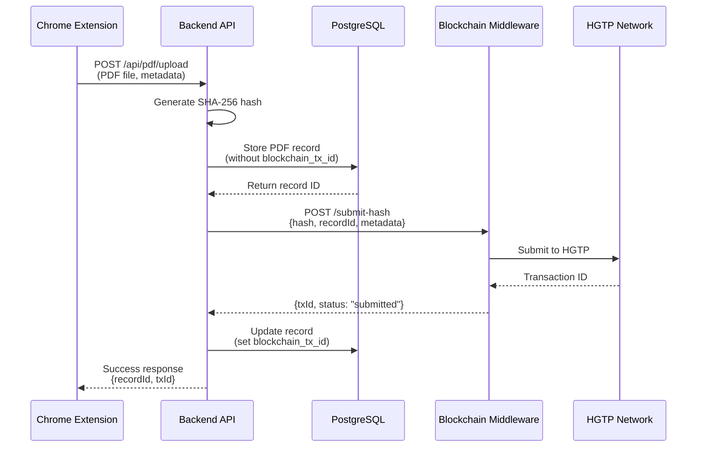
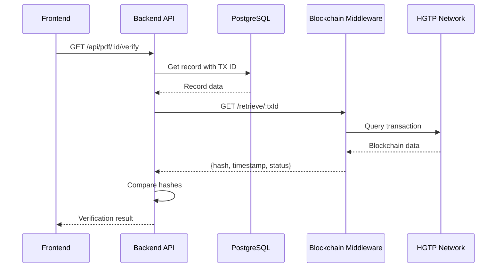

# ProofVault Blockchain Middleware Architecture Flow

## System Architecture Diagram



## Detailed Flow Sequences

### 1. PDF Upload with Blockchain Recording



### 2. Blockchain Verification Flow



## Component Details

### Backend API (Port 3001)
```
Existing Endpoints:
├── POST /api/pdf/upload
├── GET /api/pdf/list
├── GET /api/pdf/:id
└── DELETE /api/pdf/:id

New Endpoints:
├── GET /api/pdf/:id/blockchain    # Get blockchain status
└── POST /api/pdf/:id/verify       # Trigger verification
```

### Blockchain Middleware (Port 3002)
```
New Service Endpoints:
├── POST /submit-hash              # Submit hash to blockchain
│   Request: { hash, recordId, metadata }
│   Response: { txId, status }
│
├── GET /retrieve/:txId            # Get data from blockchain
│   Response: { hash, timestamp, blockHeight, status }
│
├── GET /verify/:hash              # Check if hash exists
│   Response: { exists, txId, timestamp }
│
└── GET /health                    # Service health check
```

### Database Schema Updates
```sql
-- Add blockchain columns to pdf_records table
ALTER TABLE pdf_records ADD COLUMN blockchain_tx_id VARCHAR(255);
ALTER TABLE pdf_records ADD COLUMN blockchain_status VARCHAR(50) DEFAULT 'pending';
ALTER TABLE pdf_records ADD COLUMN blockchain_timestamp TIMESTAMP;
ALTER TABLE pdf_records ADD COLUMN blockchain_metadata JSONB;
```

## Data Flow Examples

### Success Case
```
1. User captures screenshot in Chrome Extension
2. Extension generates PDF with metadata
3. PDF uploaded to Backend API
4. Backend stores PDF, generates hash
5. Backend calls Middleware to submit hash
6. Middleware writes to HGTP blockchain
7. Transaction ID returned and stored
8. User can verify later via Frontend
```

### Async Processing (Alternative)
```
1. Backend stores PDF with status='pending_blockchain'
2. Background job picks up pending records
3. Submits to blockchain via middleware
4. Updates status to 'blockchain_confirmed'
5. Webhook notifies frontend of completion
```

## Benefits of This Architecture

1. **Separation of Concerns**
   - Backend focuses on PDF management
   - Middleware handles all blockchain complexity

2. **Scalability**
   - Can scale blockchain operations independently
   - Queue system prevents overload

3. **Reliability**
   - Retry logic for failed blockchain submissions
   - No data loss if blockchain is temporarily unavailable

4. **Flexibility**
   - Easy to add support for multiple blockchains
   - Can switch blockchain providers without touching main backend

5. **Security**
   - Blockchain credentials isolated in middleware
   - API key authentication between services